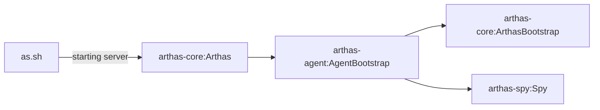
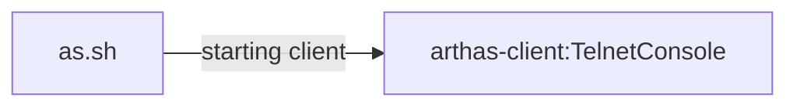
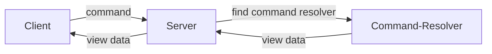

## 准备工作
Arthas为什么这么神奇？还是说真的有这么神奇？实现原理是什么？如何工作的？

带着这些疑问，跟着笔者进入<<走进Arthas>>相关栏目，一起剖析Arthas源码~

本文章的相关Arthas改造过的源码都可以从笔者Github Fork的地址获取[https://github.com/ainilili/arthas](https://github.com/ainilili/arthas)

## 调试Arthas
Arthas正常运行流程如下：
- 启动``.bat``或者``.sh``脚本
- 在脚本中拼接启动参数，运行``arthas-core``模块中``Arthas``类的主函数
- 匹配pid, 并加载Agent, 这时涉及另一个模块——``arthas-agent``
- 在``arthas-agent``获取到[Instrumentation](https://baike.baidu.com/item/Java%20Instrumentation/2478249?fr=aladdin)，并加载``arthas-spy``勾子模块和``ArthasBootStrap``Server服务
- 进行客户端和服务端的交互

Server启动链

Client启动链


Arthas使用``telnet``的方式进行Server-Client模式的通讯，对应的启动入口如下：
 - 服务端启动入口：``arthas-core`` 包 ``com.taobao.arthas.core.Arthas``
 - 客户端启动入口：``arthas-client`` 包 ``com.taobao.arthas.client.TelnetConsole``

如果我们按照正常套路去运行Arthas，我想是不可能那么直观的了解Arthas是如何工作的，最好的方式是导入到IDE中并进行断点调试~

当然，如果你直接导入源码到IDE中并找到上述两个类启动的话，那么很遗憾，你一定会失败！

首先，这两个类的主函数入口需要一些必填参数，这里就不详述，大致为``telnet``端口和``java pid``之类的配置，如果你真的想启动，可以像我一样构造一些请求参数：
```
Server:
args = new String[] {"-pid","6052","-target-ip","127.0.0.1","-core","C:\\Users\\admin\\.arthas\\lib\\3.0.4\\arthas\\arthas-core.jar","-agent","C:\\Users\\admin\\.arthas\\lib\\3.0.4\\arthas\\arthas-agent.jar"};

Client:
args = new String[] {"127.0.0.1","-c","xxx"};
```

其中，``-core``和``-agent``两个包可以启动源码中``install.sh``获取到~

另外，需要在启动参数中指定``tools.jar``的位置：
```
-Xbootclasspath/a:D:/jdk/lib/tools.jar
```
``D:/jdk/lib/tools.jar``为tools.jar的绝对路径，``VirtualMachine.list()``需要这个jar库！

至此，如果你按照我上面的叙述那样做，现在多半已已经可以成功启动服务端，或许你也可以当成一篇技术文章来看待，继续阅读下去!

服务端和客户端使用``telnet``协议进行交互，其中客户端通过``-c``的方式在主函数入口处传入指令，并在之后发送给服务端，服务端予以响应，通过模拟不同的指令我们便可以对Arthas进行debug调试，深入理解Arthas的运行原理！

> TIP：在启动服务端之后，我们可以通过控制台的打印去找到arthas.log文件路径，在其中我们可以看到arthas服务运行的详细日志，如果发现telnet端口被占用，极大的可能是你的IDE或者机器上的某个应用也使用了该端口，这时我们可以去修改arthas的telnet默认端口解决这个问题，他们分别在两个主类头部定义，不难找到！

## 测试指令

继续深入，当客户端连接之后，服务端会响应Logo给客户端显示，之后再去处理客户端传来的指令，这一点可以很容易的在``arthas-core``模块``com.taobao.arthas.core.shell.impl.ShellServerImpl``类中看到：
```
 public void handleTerm(Term term) {
        synchronized (this) {
            // That might happen with multiple ser
            if (closed) {
                term.close();
                return;
            }
        }

        ShellImpl session = createShell(term);
        //webcomeMessage内容即Logo及相关信息
        session.setWelcome(welcomeMessage);
        session.closedFuture.setHandler(new SessionClosedHandler(this, session));
        session.init();
        sessions.put(session.id, session); // Put after init so the close handler on the connection is set
        session.readline(); // Now readline
    }
```

以上是最基本的一个指令，但是不涉及交互过程，只是单纯的服务端监听到客户端连接，并响应，在之后，客户端将会发送``-c``后的指令到服务端，服务端会找到对应的指令解析器去处理，至于有哪些指令解析器？我们可以在``arthas-core``模块下``ArthasBootstrap``类``bind``方法中找到对应的指令集列表：
```
BuiltinCommandPack builtinCommands = new BuiltinCommandPack();
```
稍微跟进一下（进入``BuiltinCommandPack``类），会发现一个新大陆~
```
private static void initCommands() {
        commands.add(Command.create(HelpCommand.class));
        commands.add(Command.create(KeymapCommand.class));
        commands.add(Command.create(SearchClassCommand.class));
        ....
        ....
}
```
所有的指令相关信息我们都可以通过在上述``**Command.class``中的头部注解中可以看到，如：
 - ``@Name`` 指令名
 - ``@Summary`` 备注
 - ``@Description`` 具体使用描述

由此，我们可以通过一个最简单的``helper``指令体验一下，对于我们之前的代码我们只需要改动客户端的主函数入参即可：
```
Client:
args = new String[] {"127.0.0.1","-c","help"};
```
之后启动Client，得到反馈：
```
$ help | plaintext
 NAME         DESCRIPTION                                                                                          
 help         Display Arthas Help                                                                                   
 keymap       Display all the available keymap for the specified connection.                                            
 sc           Search all the classes loaded by JVM                                                                      
 sm           Search the method of classes loaded by JVM                                                                
 classloader  Show classloader info                                                                                     
 jad          Decompile class                                                                                           
 getstatic    Show the static field of a class                                                                          
 monitor      Monitor method execution statistics, e.g. total/success/failure count, average rt, fail rate, etc.        
 stack        Display the stack trace for the specified class and method                                                
 thread       Display thread info, thread stack                                                                         
 trace        Trace the execution time of specified method invocation.                                                  
 watch        Display the input/output parameter, return object, and thrown exception of specified method invocation    
 tt           Time Tunnel                                                                                               
 jvm          Display the target JVM information                                                                        
 dashboard    Overview of target jvm's thread, memory, gc, vm, tomcat info.                                             
 dump         Dump class byte array from JVM                                                                            
 options      View and change various Arthas options                                                                    
 cls          Clear the screen                                                                                          
 reset        Reset all the enhanced classes                                                                            
 version      Display Arthas version                                                                                    
 shutdown     Shut down Arthas server and exit the console                                                              
 session      Display current session information                                                                       
 sysprop      Display, and change the system properties.                                                                
 redefine     Redefine classes. @see Instrumentation#redefineClasses(ClassDefinition...)    
```
一个不够？在试一下``keymap``指令：
```
Client:
args = new String[] {"127.0.0.1","-c","keymap"};
```
服务端反馈：
```
$ keymap | plaintext
"\C-a": beginning-of-line
"\C-e": end-of-line
"\C-f": forward-word
"\C-b": backward-word
"\e[D": backward-char
"\e[C": forward-char
"\e[B": next-history
"\e[A": previous-history
"\C-h": backward-delete-char
"\C-?": backward-delete-char
"\C-u": undo
"\C-d": delete-char
"\C-k": kill-line
"\C-i": complete
"\C-j": accept-line
"\C-m": accept-line
"\C-w": backward-delete-word
"\C-x\e[3~": backward-kill-line
"\e\C-?": backward-kill-word
```

看来流程没有错，我们可以进入下一阶段了！
## 总结
Arthas是一个机遇``telnet``协议的客户端和服务端交互的过程，服务端于被监控的机器上运行，客户端通过``ip:port``连接服务端获取监控信息，对于Arthas来讲，最基础的指令实现是继承``AnnotatedCommand``这个类，例如上文讲的``help``指令就是一个简单的例子~

``AnnotatedCommand``是一个抽象类，继承它的类需要实现``process(CommandProcess process)``方法，通过process可以获取到当前监控的jvm实例相关信息，例如所有的类加载器或者所有的类等。之后Arthas要做的就是通过不同的指令去做不同的处理将数据聚合并相应给客户端显示！

当然，有些指令使用``AnnotatedCommand``是满足不了的，如定时监控，需要实时不断的将监控信息推送给客户端，这时就要通过继承``EnhancerCommand``类来做到这一点。

以上，Arthas的基本架构如下：

总体感觉，Arthas是一个轻量级的监控工具，小巧灵活，简单易用，整体框架设计清晰，网络内核使用netty使得可用性及性能大大提高，值得一用~
